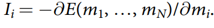

# Implementing Optimization Algorithms Using Probability Computing

## Introduction

The goal of this project is to solve some of the computationally hard problems, which can be performed as combinatorial optimization problems, using probability computing. 

The idea of probability computing is to create a circuit of so-called p-bits. They can be perceived as stochastic building blocks with a normalized output - random variable with Bernoulli distribution. 

The probability determining this distribution is calculated from the current state of the circuit using input-output relations of p-bits. 

Therefore, by updating p-bits we generate new states of the system, from which we want to find states that minimise the energy defined by the optimisation problem.  

The ability of this approach to produce correct results is based primarily on Boltzmann's law, which says that at a certain temperature the states that minimise energy occur with the highest probability. This law is fulfilled provided that the input of each bit is a negated partial derivative with respect to p-bit m_i. It is called *synaptic input*.

## Method

### **Determine the energy function, the minimum of which will correspond to the solution of the set problem.**

For the integer factorization problem on the surface lies the squared deviation from the number is needed to factorize, as one of the possible energy functions. (*transfer to Demo notebooks for the implementation*) 

It turns out that there is a class of problems whose energy will be linear in each of the parameters. They are called quadratic energy models or the **Ising
model**, typically mapped to problems in non-deterministic polynomial time. 

It is defined by two parameters: weight matrix W and bias vector h.
Not for all optimisation problems these coefficients can be determined from the proofs that have been done so far. Hence we need to somehow get these coefficients from the problem to be solved.

#### **Define the problem using invertible logic and then determine the coefficients** 

Some optimization problems are easy to define using invertible logic circuits. For example, Max-SAT is a generalization of the Boolean satisfiability problem and, as such, consists of a Boolean
formula in conjunctive normal form which can be converted in a Boolean circuit realized with AND and OR logic gates.

Now the question is how to define the elements of the circuits and connect them in terms of Ising models. And there is an answer:
- Defining

*For the implementation of the AND-gate transfer to Demo Notebooks* 
- Connecting 

### **Define the order of p-bit state changing and activation function**

Activation function is the function that calculates the output of the p-bit using synaptic input as a parameter. In the p-bit circuit implementation it is defined as:

Beta is a inverse temperature, r is a uniformly distributed random number from [-1, 1]

Order of p-bit state changing depends on the architecture of p-bit computer. In this realisation for each step the random permutation of indices is chosen - this is the order for current step. This implementation ensures that every p-bit was updated as many times as other bits.

### **Define the inverse temperature**
Inverse temperature is an important parameter in the algorithm, because it defines the fluctuation behaviour and helps to achieve the energy global minimum. 
#### **Beta search algorithm - linear annealing**  

### **Demo notebooks**

Notebook [factorisation_beta.ipynb](Implementing-Optimization-Algorithms-Using-Probability-Computing/factorisation_beta.ipynb) presents an example of solving Integer factorisation problem using the energy function, which prevents it from being considered as an ising model, because it is not linear.

Notebook [ising_model_beta.ipynb](Implementing-Optimization-Algorithms-Using-Probability-Computing/ising_model_beta.ipynb) presents an example of using Ising Model for the implementing invertible AND-gate behaviour.
