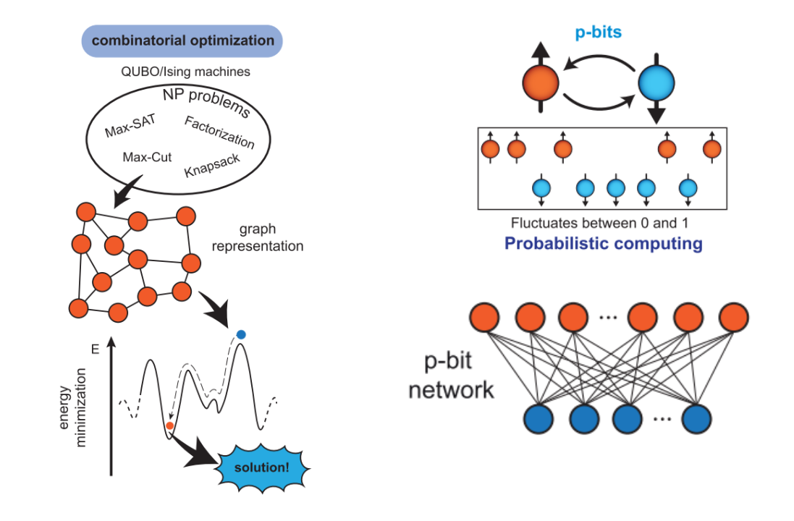

# **Introduction**

The aim of this project is to investigate the development of hybrid models of probabilistic with quantum computations to explore the potential for enhancing the computational power of current state-of-the-art NISQ computing.

These models are primarly used for solving the computationally hard problems, which can be performed as combinatorial optimization problems, where the search space is finite, but too large to observe all states. 

In this publication, we consider the implementation approach on the example of the number partitioning problem. 

# **Method**

The idea of probabilistic computing is to create a circuit of so-called p-bits. They can be perceived as stochastic building blocks with a normalized output $m_i \in \{-1, 1\}$, which is calculated from the current state of the circuit using input-output relations of p-bits. We will call the state of the system the current ordered set of p-bit values.

It appears that there exists a class of problems where the energy is quadratic with respect to each of the parameters. They are called quadratic energy models or the **Ising
model**, and they are often mapped to NP-hard problems. 

$$E(m_1, m_2, \ldots) = -\sum_{i \leq j} (W_{ij} m_i m_j + h_i m_i)
$$

It is defined by two parameters: weight matrix W and bias vector h.

**Example: number partitioning problem**

Number partitioning is the task of deciding whether a given multiset $S = \{a_1, ...,  a_n\}$ of positive integers can be partitioned into two subsets $S_1$ and $S_2$ such that the sum of the numbers in $S_1$ equals the sum of the numbers in $S_2$.

Hence we can define the energy function as $(\sum_{i} a_i m_i)^2$. Note that $m_i \in \{-1, 1\}$, hence the minimum of energy is zero $\iff$ the partitioning exists.

Now that is easy to see that we can define the matrix $W$: $W_{ij} = - a_i a_j$ and the bias vector $h$: $h_i = 0$. 

# **Algorithm**

- **Determine the energy function, the minimum of which will correspond to the solution of the given problem.**

In the considered example it is $$E(m_1, m_2, \ldots, m_n) = (\sum_{i} a_i m_i)^2$$ The key is to determine weights matrix W and bias vector h.

- **Define the initial state of the p-bits**.

 $\forall i$ $m_i = 1$ is good choice.

- **Choose the order of p-bit state changing** 

The order in which p-bits change their states in a p-bit computer architecture depends on random permutations of indices for each step. This implementation ensures that every p-bit is updated an equal number of times as other bits. This approach promotes fairness in state transitions, prevents bias towards specific p-bits, and balances the computational load across them.

- **For each p-bit**
    - calculate the new output using *activation function*

    $$m_i = f(\beta, I_i) = sign(\tanh(\beta I_i) - rand([-1, 1]))$$
            Where I_i is the input of each bit and is a negated partial derivative with respect to p-bit m_i. It is called synaptic input.
    $$I_i = -\frac{\delta E(m_1, \ldots, m_n)}{\delta m_i}$$
            and \beta is a inverse temperature - an important parameter in the algorithm, because it defines the fluctuation behaviour and helps to achieve the energy global minimum. 

    - Increase $\beta$ (cool the system) if the new state has a lower energy
            
            At high temperatures updates that change the energy of the system are comparatively more probable. When the system is highly correlated, updates are rejected and the simulation is said to suffer from critical slowing down. Hence we are starting with low inverse temperature $\beta$ and then after every successful energy change we increase it's value to help the system to obtain the minimal energy value.

- **Return the state that corresponds to the minimum energy achieved.**

    The ability of this approach to produce correct results is based primarily on Boltzmann's law, which says that at a certain temperature ($1 / \beta$) the states that minimise energy occur with the highest probability.
    
### **Notebooks**

Notebook [factorisation_beta.ipynb](Implementing-Optimization-Algorithms-Using-Probability-Computing/factorisation_beta.ipynb) presents an example of solving Integer factorisation problem using the energy function, which prevents it from being considered as an ising model, because it is not linear.

Notebook [ising_model_and_gate.ipynb](Implementing-Optimization-Algorithms-Using-Probability-Computing/ising_model_beta.ipynb) presents an example of using Ising Model for the implementing invertible AND-gate behaviour.

Notebook [ising_model_np_problems.ipynb](Implementing-Optimization-Algorithms-Using-Probability-Computing/ising_model_np_problems.ipynb) presents an example of using Ising Model for the implementing Number Partitioning and Minimum Bisection Problem
